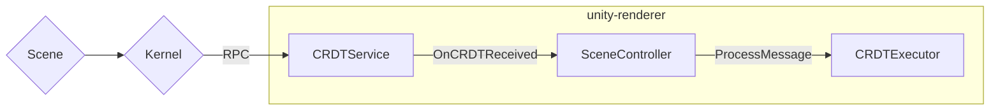
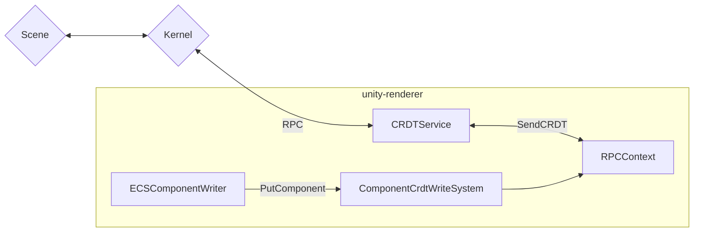

# Scene Messages

Scene messages are sent using RPC in a Protobuf message.
(https://github.com/decentraland/protocol/blob/main/renderer-protocol/RendererProtocol.proto)
Payload of such message is a byte array

## Message structure
``` protobuf
string scene
bytes payload: {
	int32 message_length    // Bytes length of the message
	int32 message_type      // PUT_COMPONENT | DELETE_COMPONENT
	int32 entity_id         // Entity number
	int32 component_id      // ClassIdentifier number for the component kind
	int64 timestamp         // Lamport timestamp
	int32 data_length       // Amount of bytes of data
	bytes data              // @optional
				// Component data
				// Missing data with PUT_COMPONENT means that component should use all it default properties
}
```

since we are sending several scene messages in a single message, the payload byte array will probably look something like this:
``` protobuf
int32 message_length // [MESSAGE_0]
int32 message_type
int32 entity_id
int32 component_id
int64 timestamp
int32 data_length
bytes data
int32 message_length // [MESSAGE_1]
int32 message_type
int32 entity_id
int32 component_id
int64 timestamp
int32 data_length
bytes data
int32 message_length // [MESSAGE_2]
int32 message_type
int32 entity_id
int32 component_id
int64 timestamp
int32 data_length
bytes data
// [...]
```

## Scene to Renderer message flow



## Renderer to Scene message flow
Before it update, every scene will try to pull it messages from the renderer.


